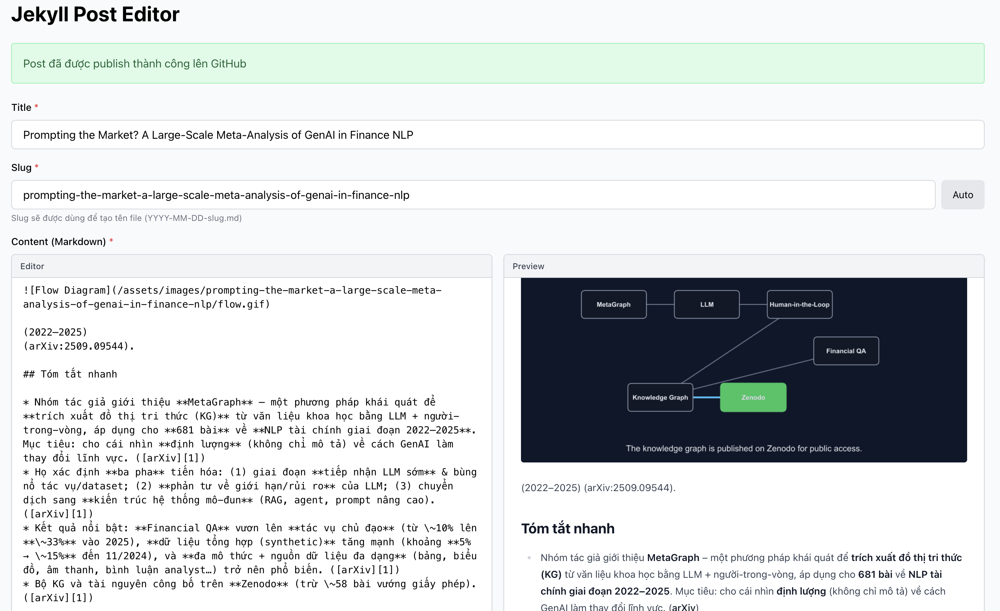
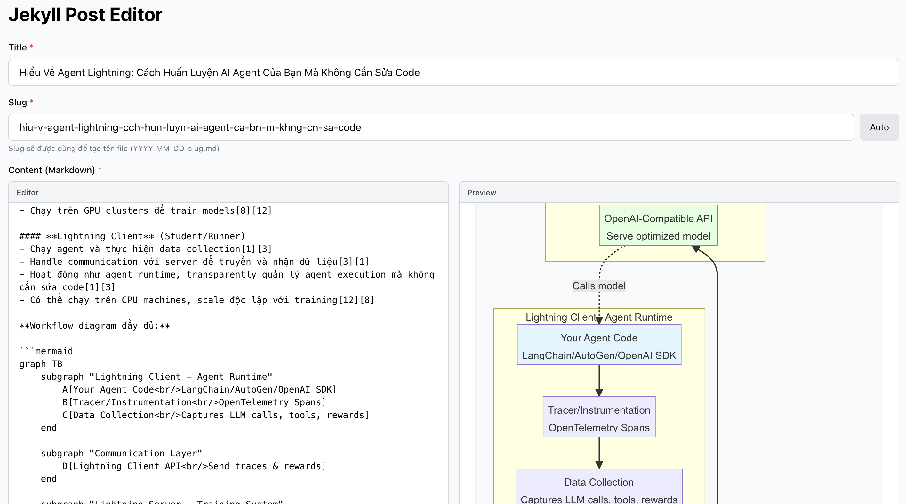

# Editor for write blog technology and programming

## Option 1: Use editor for write blog. (Recommended)






1. Fork this repository.

2. Clone your repository.
```
git clone https://github.com/your-username/your-repository.git
```

3. Install dependencies
```
yarn install
```

4. Run the editor
```
yarn dev
```

5. Open the editor in your browser
```
http://localhost:3000
```

It will show list post, click on post to edit, have button "New post" to create new post, have button "Publish" to publish post to GitHub.
