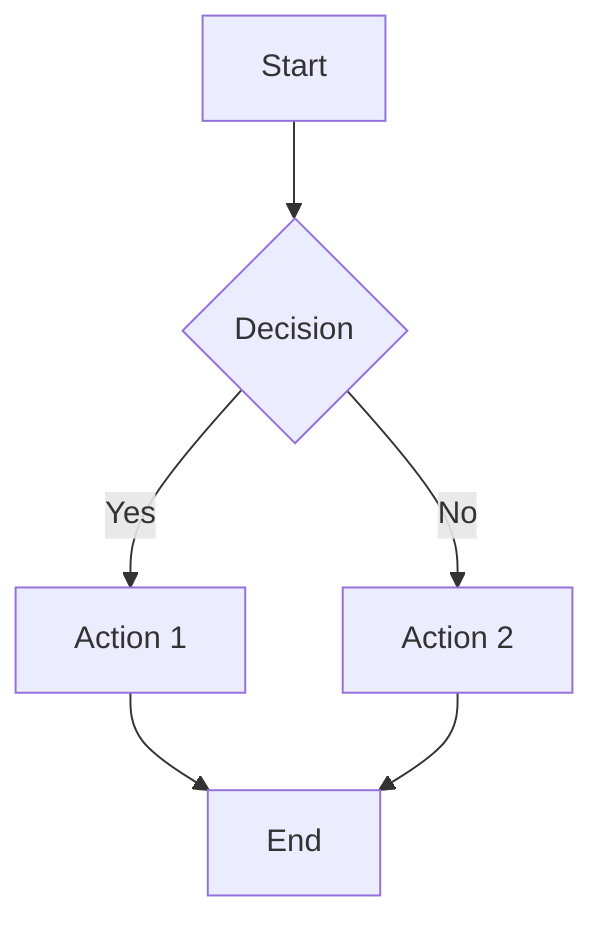
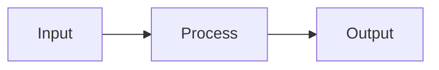
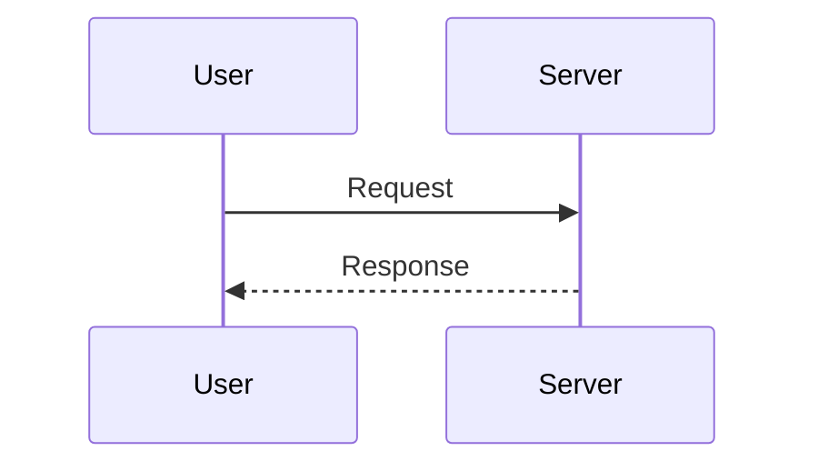
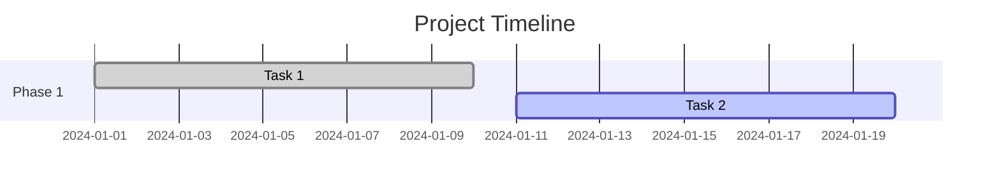
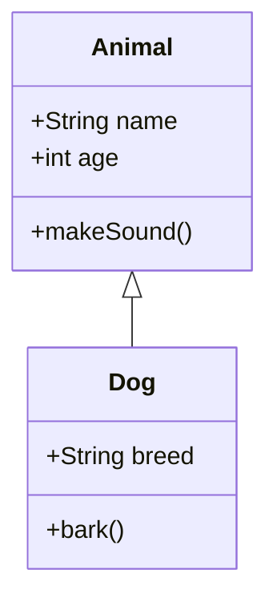
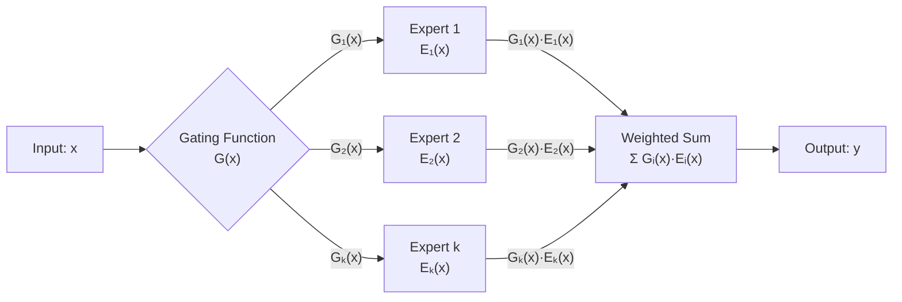

# Hướng dẫn sử dụng Mermaid trong Jekyll Blog

Blog Jekyll của bạn đã được cấu hình để hỗ trợ Mermaid diagrams. Dưới đây là cách sử dụng:

## Cách thêm Mermaid diagram

### 1. Sử dụng code block với class `mermaid`

```markdown

```

### 2. Sử dụng div với class `mermaid`

```html
<div class="mermaid">
graph TD
    A[Start] --> B{Decision}
    B -->|Yes| C[Action 1]
    B -->|No| D[Action 2]
    C --> E[End]
    D --> E
</div>
```

## Các loại biểu đồ được hỗ trợ

### 1. Flowchart (Sơ đồ luồng)



### 2. Sequence Diagram (Sơ đồ tuần tự)



### 3. Gantt Chart (Biểu đồ Gantt)



### 4. Class Diagram (Sơ đồ lớp)



## Ví dụ thực tế từ blog

Dưới đây là một ví dụ từ bài viết về LLM:



## Mẹo sử dụng

1. **Sử dụng HTML entities** cho các ký tự đặc biệt: `&lt;`, `&gt;`, `&amp;`
2. **Thêm `<br/>`** để xuống dòng trong labels
3. **Sử dụng quotes** cho labels có ký tự đặc biệt: `"Label with spaces"`
4. **Test trước** trên [Mermaid Live Editor](https://mermaid.live/)

## Cấu hình hiện tại

Blog đã được cấu hình với:
- Mermaid version 10
- Theme: default
- Security level: loose
- Responsive design
- Custom CSS styling

Chúc bạn viết blog thành công với Mermaid! 🎉
