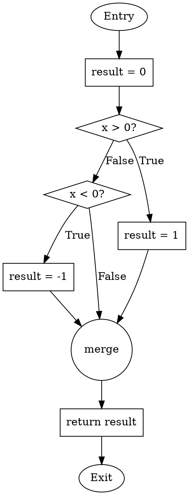
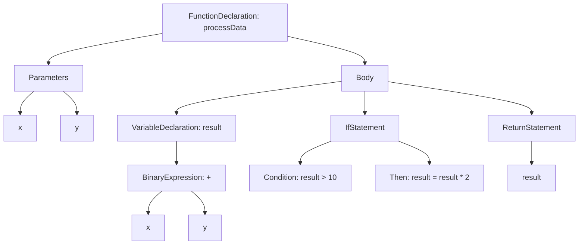
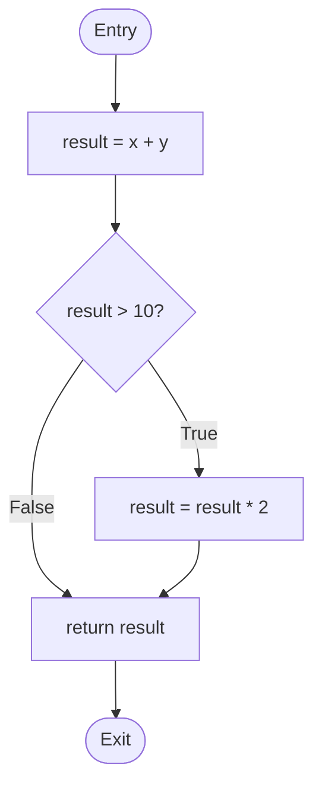

## Executive Summary

This research document examines three fundamental techniques for parsing and analyzing source code structure: Abstract Syntax Trees (AST), Control Flow Graphs (CFG), and Data Flow Analysis (DFA). Each technique serves distinct purposes in program analysis, optimization, and verification, with unique strengths and weaknesses.

---

## 1. Abstract Syntax Tree (AST)

### Definition
An Abstract Syntax Tree is a tree-structured representation of the syntactic structure of source code, where each node represents a construct from the source code. Unlike parse trees, ASTs abstract away syntactic details like punctuation and grouping symbols, focusing on the essential semantic structure.

### Key Characteristics

**Structure:**
- Interior nodes represent operators/operations
- Leaf nodes represent operands (variables, literals)
- Root node represents the top-level construct
- No representation of punctuation (parentheses, semicolons)
- Captures operator precedence through tree depth

**Generation Process:**
1. Lexical analysis (tokenization)
2. Syntactic analysis (parsing)
3. AST construction from parse tree
4. Optional semantic enrichment

### Strengths

#### 1. **Compact and Focused Representation**
- Eliminates redundant syntactic details
- More concise than parse trees
- Easier to navigate and manipulate

#### 2. **Semantically Meaningful**
- Captures program structure and relationships
- Preserves operator precedence implicitly
- Ideal for semantic analysis and type checking

#### 3. **Language-Independent Potential**
- Can represent essential elements across different languages
- Facilitates cross-language analysis tools
- Enables universal intermediate representations

#### 4. **Excellent for Code Transformation**
- Safe manipulation compared to text/regex
- Context-aware modifications
- Supports refactoring and code generation

#### 5. **Foundation for Multiple Tools**
- Compilers (semantic analysis, code generation)
- Linters and static analyzers
- Code formatters and beautifiers
- IDE features (auto-completion, navigation)
- Documentation generators

### Weaknesses

#### 1. **Loss of Syntactic Details**
- Missing information for exact source reconstruction
- No formatting or style information
- Cannot distinguish between equivalent forms (e.g., `a += 1` vs `a = a + 1`)

#### 2. **Language-Specific Structure**
- No universal AST format
- Each language/parser may have different representations
- Integration challenges between tools

#### 3. **Additional Processing Required**
- Extra step after parsing adds overhead
- Not suitable for very time-sensitive applications
- May require multiple passes for complex analysis

#### 4. **Limited Runtime Information**
- No execution order information
- Cannot determine reachability
- Doesn't capture control flow explicitly

#### 5. **Complexity for Large Programs**
- Tree size grows with code complexity
- Memory overhead for large codebases
- Traversal can be computationally expensive

### Practical Example

**Source Code:**
```python
result = (2 + 3) * 4
```

**AST Representation:**
```
        Assignment
         /      \
    result    Multiply
               /      \
           Plus        4
          /    \
         2      3
```

**Visualization Data (JSON format):**
```json
{
  "type": "Assignment",
  "target": {
    "type": "Identifier",
    "name": "result"
  },
  "value": {
    "type": "BinaryOp",
    "operator": "*",
    "left": {
      "type": "BinaryOp",
      "operator": "+",
      "left": {"type": "Literal", "value": 2},
      "right": {"type": "Literal", "value": 3}
    },
    "right": {"type": "Literal", "value": 4}
  }
}
```

### Python AST Example

```python
import ast

code = """
def calculate_sum(a, b):
    result = a + b
    return result
"""

tree = ast.parse(code)

# AST structure
"""
Module
└── FunctionDef: calculate_sum
    ├── arguments
    │   ├── arg: a
    │   └── arg: b
    └── body
        ├── Assign
        │   ├── targets: [Name: result]
        │   └── value: BinOp
        │       ├── left: Name: a
        │       ├── op: Add
        │       └── right: Name: b
        └── Return
            └── value: Name: result
"""
```

---

## 2. Control Flow Graph (CFG)

### Definition
A Control Flow Graph is a directed graph representation of all possible execution paths through a program. Nodes represent basic blocks (sequences of statements with single entry and exit points), and edges represent control flow between blocks.

### Key Characteristics

**Structure:**
- **Nodes**: Basic blocks (sequential statements)
- **Edges**: Control flow transitions (branches, jumps, falls-through)
- **Entry Node**: Starting point (no incoming edges)
- **Exit Node**: Ending point (no outgoing edges)

**Basic Block Properties:**
- Single entry point (only first instruction is entry)
- Single exit point (only last instruction is exit)
- Sequential execution within block
- No internal branching

### Strengths

#### 1. **Explicit Control Flow Representation**
- Clear visualization of execution paths
- All possible runtime paths visible
- Easy to identify loops and branches

#### 2. **Excellent for Program Analysis**
- **Reachability analysis**: Identify unreachable code
- **Dominance analysis**: Determine control dependencies
- **Loop detection**: Identify natural loops and back edges
- **Path analysis**: Count and enumerate execution paths

#### 3. **Foundation for Optimization**
- Dead code elimination
- Common subexpression elimination
- Loop optimizations (unrolling, invariant code motion)
- Register allocation

#### 4. **Security Analysis**
- Malware detection through CFG matching
- Control-flow integrity (CFI) enforcement
- Vulnerability detection
- Attack surface analysis

#### 5. **Compiler Backend Foundation**
- Intermediate representation (IR) generation
- Code generation
- Instruction scheduling
- Branch prediction optimization

#### 6. **Testing and Coverage**
- Path coverage calculation
- Branch coverage analysis
- Test case generation
- Cyclomatic complexity measurement

### Weaknesses

#### 1. **No Data Flow Information**
- Cannot track variable values
- Missing variable dependencies
- Requires separate data flow analysis

#### 2. **Complexity for Large Programs**
- Exponential path explosion in complex programs
- Difficult to visualize large CFGs
- Interprocedural analysis is computationally expensive

#### 3. **Imprecise for Dynamic Features**
- Function pointers/virtual calls create uncertainty
- Dynamic dispatch complicates analysis
- Reflection and eval() are problematic

#### 4. **Conservative Path Representation**
- May include infeasible paths
- Cannot determine all path constraints
- Over-approximation of actual behavior

#### 5. **Statement-Level Granularity Tradeoff**
- Too fine-grained: excessive nodes, complex graphs
- Too coarse-grained: lost precision
- Balance is language and analysis dependent

### Practical Example

**Source Code:**
```python
def check_number(x):
    result = 0
    if x > 0:
        result = 1
    elif x < 0:
        result = -1
    return result
```

**CFG Representation:**
```
    [Entry]
       ↓
    [B1: result = 0]
       ↓
    [B2: if x > 0]
       ↓       ↘
    [True]    [B3: elif x < 0]
       ↓         ↓       ↘
    [B4: result=1]  [True]  [False]
       ↓           ↓           ↓
       ↓      [B5: result=-1] ↓
       ↓           ↓           ↓
       └───────→ [B6] ←────────┘
                  ↓
           [B7: return result]
                  ↓
               [Exit]
```

**Visualization Data (DOT format for Graphviz):**


**JavaScript CFG Example:**
```javascript
function findMax(arr) {
    if (arr.length === 0) return null;
    
    let max = arr[0];
    for (let i = 1; i < arr.length; i++) {
        if (arr[i] > max) {
            max = arr[i];
        }
    }
    return max;
}

/*
CFG Basic Blocks:

B1 (Entry):
  - if (arr.length === 0)

B2 (Early Return):
  - return null

B3 (Init):
  - max = arr[0]
  - i = 1

B4 (Loop Condition):
  - i < arr.length

B5 (Loop Body):
  - if (arr[i] > max)

B6 (Update Max):
  - max = arr[i]

B7 (Increment):
  - i++

B8 (Final Return):
  - return max

B9 (Exit)

Edges:
B1 -> B2 (true)
B1 -> B3 (false)
B2 -> B9
B3 -> B4
B4 -> B5 (true)
B4 -> B8 (false)
B5 -> B6 (true)
B5 -> B7 (false)
B6 -> B7
B7 -> B4 (back edge)
B8 -> B9
*/
```

---

## 3. Data Flow Analysis (DFA)

### Definition
Data Flow Analysis is a technique for gathering information about the possible set of values and their flow through a program. It operates on the Control Flow Graph to determine how data propagates from definitions to uses across all execution paths.

### Key Characteristics

**Analysis Types:**
- **Forward Analysis**: Information flows from entry to exit
- **Backward Analysis**: Information flows from exit to entry
- **May Analysis**: Facts true on some path
- **Must Analysis**: Facts true on all paths

**Core Concepts:**
- **Gen Set**: Information generated at a point
- **Kill Set**: Information invalidated at a point
- **In Set**: Information before a point
- **Out Set**: Information after a point

### Common DFA Problems

#### 1. **Reaching Definitions** (Forward May)
- Which definitions reach a program point?
- Used for: Constant propagation, variable initialization checks

#### 2. **Live Variables** (Backward May)
- Which variables are live at a program point?
- Used for: Dead code elimination, register allocation

#### 3. **Available Expressions** (Forward Must)
- Which expressions are computed on all paths?
- Used for: Common subexpression elimination

#### 4. **Very Busy Expressions** (Backward Must)
- Which expressions will be used on all paths?
- Used for: Code motion optimization

### Strengths

#### 1. **Powerful Optimization Capability**
- **Constant propagation**: Replace variables with constants
- **Dead code elimination**: Remove unused code
- **Common subexpression elimination**: Avoid redundant computations
- **Copy propagation**: Eliminate unnecessary copies

#### 2. **Error Detection**
- Uninitialized variable detection
- Null pointer dereference detection
- Type safety violations
- Resource leak detection

#### 3. **Precise Dependency Tracking**
- Variable dependencies across statements
- Effect of assignments on program state
- Influence of conditions on values

#### 4. **Handles Complex Control Flow**
- Loops (with iterative fixpoint)
- Nested conditions
- Multiple entry/exit points
- Exception handling

#### 5. **Interprocedural Analysis**
- Cross-function analysis
- Call-context sensitivity
- Return value propagation

#### 6. **Scalability**
- Efficient algorithms (O(n) to O(n³) depending on analysis)
- Incremental analysis possible
- Modular analysis for large programs

### Weaknesses

#### 1. **Conservative Approximations**
- Must over-approximate (for soundness)
- May include infeasible paths
- Cannot determine all path constraints
- Results may be imprecise

#### 2. **Computationally Expensive**
- Iterative algorithms require multiple passes
- Fixpoint computation can be slow
- Interprocedural analysis is costly
- Memory requirements grow with program size

#### 3. **Limited by Static Analysis**
- Cannot handle dynamic features precisely
- Function pointers complicate analysis
- Reflection and dynamic code generation are problematic
- Runtime values unknown

#### 4. **Complexity for Pointer Analysis**
- Aliasing complicates analysis significantly
- May/must aliases require separate analysis
- Points-to analysis is often required
- Context sensitivity adds complexity

#### 5. **Lattice Design Challenges**
- Choosing appropriate abstraction is difficult
- Too coarse: imprecise results
- Too fine: computation explosion
- Domain-specific expertise required

#### 6. **Interprocedural Challenges**
- Context sensitivity vs. efficiency tradeoff
- Recursive functions are difficult
- Virtual/indirect calls add imprecision
- Whole-program analysis doesn't scale

### Practical Example

**Source Code:**
```python
def analyze_example():
    a = 10        # Line 1
    b = 20        # Line 2
    if condition:  # Line 3
        c = a + b  # Line 4
    else:
        c = a - b  # Line 5
    print(c)      # Line 6
```

**Reaching Definitions Analysis:**

```
Point    | Reaching Definitions
---------|--------------------
Line 1   | {} (empty)
Line 2   | {a=10 @line1}
Line 3   | {a=10 @line1, b=20 @line2}
Line 4   | {a=10 @line1, b=20 @line2}
Line 5   | {a=10 @line1, b=20 @line2}
Line 6   | {a=10 @line1, b=20 @line2, c=a+b @line4 OR c=a-b @line5}
```

**Live Variables Analysis (Backward):**

```
Point    | Live Variables
---------|---------------
Line 6   | {c}
Line 5   | {c, a, b}
Line 4   | {c, a, b}
Line 3   | {a, b}
Line 2   | {a}
Line 1   | {}
```

**Detailed Example with Iterations:**

```python
def fibonacci(n):
    a = 0           # Line 1
    b = 1           # Line 2
    i = 0           # Line 3
    while i < n:    # Line 4
        temp = a    # Line 5
        a = b       # Line 6
        b = temp + b # Line 7
        i = i + 1   # Line 8
    return a        # Line 9
```

**CFG for Fibonacci:**
```
    [Entry]
       ↓
    [B1: a=0, b=1, i=0]
       ↓
    [B2: while i < n] ←──────┐
       ↓              ↘       │
    [True]           [False]  │
       ↓                ↓     │
    [B3: temp=a,         ↓     │
     a=b,                ↓     │
     b=temp+b,           ↓     │
     i=i+1] ─────────────┘     │
                               │
                          [B4: return a]
                               ↓
                            [Exit]
```

**Live Variables Analysis (Iteration 1):**

```
Block  | IN (before)           | OUT (after)
-------|----------------------|---------------------
B4     | {a}                  | {}
B3     | {a, b, i, n}         | {a, b, i, n}
B2     | {a, b, i, n}         | {a, b, i, n}
B1     | {n}                  | {a, b, i, n}
```

**Reaching Definitions Data Structure:**
```json
{
  "blocks": {
    "B1": {
      "gen": ["a@L1", "b@L2", "i@L3"],
      "kill": [],
      "in": [],
      "out": ["a@L1", "b@L2", "i@L3"]
    },
    "B2": {
      "gen": [],
      "kill": [],
      "in": ["a@L1", "b@L2", "i@L3", "a@L6", "b@L7", "i@L8"],
      "out": ["a@L1", "b@L2", "i@L3", "a@L6", "b@L7", "i@L8"]
    },
    "B3": {
      "gen": ["temp@L5", "a@L6", "b@L7", "i@L8"],
      "kill": ["a@L1", "b@L2", "i@L3"],
      "in": ["a@L1", "b@L2", "i@L3"],
      "out": ["temp@L5", "a@L6", "b@L7", "i@L8"]
    }
  }
}
```

---

## 4. Comparative Analysis

### When to Use Each Technique

| Analysis Goal | Best Technique | Reason |
|--------------|----------------|--------|
| Code refactoring | AST | Safe, structure-aware transformations |
| Syntax validation | AST | Captures grammatical structure |
| Path enumeration | CFG | Explicit control flow representation |
| Optimization | DFA on CFG | Combines control flow and data tracking |
| Dead code detection | DFA (Live Variables) | Identifies unused values |
| Security analysis | CFG + DFA | Control flow integrity + data tracking |
| Type checking | AST + DFA | Structure + value flow |

### Integration Patterns

Most sophisticated analysis tools combine all three:

**Pipeline: Source → AST → CFG → DFA**

```
Source Code
    ↓
[Lexer/Parser]
    ↓
Abstract Syntax Tree (AST)
    ↓
[CFG Builder]
    ↓
Control Flow Graph (CFG)
    ↓
[Data Flow Analyzer]
    ↓
Data Flow Facts
    ↓
[Optimization/Analysis]
    ↓
Results/Transformed Code
```

---

## 5. Visualization Examples

### Complete Example: Variable Tracking

**Source Code:**
```javascript
function processData(x, y) {
    let result = x + y;
    if (result > 10) {
        result = result * 2;
    }
    return result;
}
```

### AST Visualization (Mermaid)


### CFG Visualization (Mermaid)


### Data Flow Visualization
```
Reaching Definitions at each block:

Entry:  {}
B1:     {x@param, y@param}
B2:     {result@B1, x@param, y@param}
B3:     {result@B1, x@param, y@param}
B4:     {result@B1 OR result@B3, x@param, y@param}
Exit:   {result@B1 OR result@B3}

Live Variables (backward):

Exit:   {}
B4:     {result}
B3:     {result}
B2:     {result}
B1:     {x, y}
Entry:  {x, y}
```

---

## 6. Tool Recommendations

### AST Tools
- **Python**: `ast` module (built-in)
- **JavaScript**: 
  - `@babel/parser` (Babel)
  - `esprima`, `acorn`
  - `typescript` compiler API
- **Java**: `JavaParser`, ANTLR
- **C/C++**: Clang (libclang), `pycparser`
- **Multi-language**: Tree-sitter

### CFG Tools
- **Python**: `staticfg`, custom implementations
- **JavaScript**: `esgraph`, `ast-flow-graph`
- **Java**: Soot framework, WALA
- **LLVM**: Built-in CFG representation
- **Visualization**: Graphviz (dot), vis.js

### Data Flow Analysis Tools
- **Python**: Custom DFA implementations
- **Java**: Soot, WALA, Checker Framework
- **C/C++**: Clang Static Analyzer, Infer
- **Multi-language**: CodeQL, Semgrep
- **Educational**: DFlow (C/C++)

### Integrated Analysis Frameworks
- **LLVM**: Complete compiler infrastructure
- **Soot**: Java optimization framework
- **WALA**: IBM T.J. Watson Libraries for Analysis
- **Ghidra**: Reverse engineering platform
- **IDA Pro**: Disassembler and debugger
- **Binary Ninja**: Binary analysis platform

---

## 7. Implementation Guidelines

### Building an AST Parser

```python
import ast

class ASTVisitor(ast.NodeVisitor):
    def __init__(self):
        self.functions = []
        self.variables = []
    
    def visit_FunctionDef(self, node):
        self.functions.append({
            'name': node.name,
            'args': [arg.arg for arg in node.args.args],
            'lineno': node.lineno
        })
        self.generic_visit(node)
    
    def visit_Assign(self, node):
        for target in node.targets:
            if isinstance(target, ast.Name):
                self.variables.append({
                    'name': target.id,
                    'lineno': node.lineno
                })
        self.generic_visit(node)

# Usage
code = """
def example(x, y):
    result = x + y
    return result
"""

tree = ast.parse(code)
visitor = ASTVisitor()
visitor.visit(tree)

print("Functions:", visitor.functions)
print("Variables:", visitor.variables)
```

### Building a CFG

```python
from dataclasses import dataclass
from typing import List, Set

@dataclass
class BasicBlock:
    id: int
    statements: List[str]
    successors: Set[int]
    predecessors: Set[int]

class CFGBuilder:
    def __init__(self):
        self.blocks = {}
        self.current_block_id = 0
    
    def new_block(self, statements=None):
        block = BasicBlock(
            id=self.current_block_id,
            statements=statements or [],
            successors=set(),
            predecessors=set()
        )
        self.blocks[self.current_block_id] = block
        self.current_block_id += 1
        return block
    
    def add_edge(self, from_id, to_id):
        self.blocks[from_id].successors.add(to_id)
        self.blocks[to_id].predecessors.add(from_id)
    
    def build_cfg(self, ast_node):
        # Simplified CFG construction
        entry = self.new_block(["ENTRY"])
        current = entry
        
        # Process statements...
        # This is a simplified example
        
        return entry

# Visualization with graphviz
def visualize_cfg(cfg_builder):
    dot_code = "digraph CFG {\n"
    for block_id, block in cfg_builder.blocks.items():
        label = f"B{block_id}\\n" + "\\n".join(block.statements)
        dot_code += f'  {block_id} [label="{label}"];\n'
        for succ in block.successors:
            dot_code += f"  {block_id} -> {succ};\n"
    dot_code += "}\n"
    return dot_code
```

### Implementing Data Flow Analysis

```python
class DataFlowAnalyzer:
    def __init__(self, cfg):
        self.cfg = cfg
        self.gen_sets = {}
        self.kill_sets = {}
        self.in_sets = {}
        self.out_sets = {}
    
    def reaching_definitions(self):
        # Initialize
        for block_id in self.cfg.blocks:
            self.in_sets[block_id] = set()
            self.out_sets[block_id] = set()
            self.compute_gen_kill(block_id)
        
        # Iterative fixpoint
        changed = True
        while changed:
            changed = False
            for block_id, block in self.cfg.blocks.items():
                # IN[B] = ∪(OUT[P] for P in predecessors(B))
                new_in = set()
                for pred_id in block.predecessors:
                    new_in.update(self.out_sets[pred_id])
                
                # OUT[B] = GEN[B] ∪ (IN[B] - KILL[B])
                new_out = self.gen_sets[block_id].union(
                    new_in - self.kill_sets[block_id]
                )
                
                if new_in != self.in_sets[block_id] or \
                   new_out != self.out_sets[block_id]:
                    changed = True
                    self.in_sets[block_id] = new_in
                    self.out_sets[block_id] = new_out
        
        return self.in_sets, self.out_sets
    
    def compute_gen_kill(self, block_id):
        block = self.cfg.blocks[block_id]
        gen = set()
        kill = set()
        
        for stmt in block.statements:
            # Simplified: parse assignments
            if '=' in stmt:
                var = stmt.split('=')[0].strip()
                definition = f"{var}@B{block_id}"
                gen.add(definition)
                # Kill all other definitions of var
                for other_def in self.all_definitions():
                    if other_def.startswith(var + '@'):
                        kill.add(other_def)
        
        self.gen_sets[block_id] = gen
        self.kill_sets[block_id] = kill
    
    def all_definitions(self):
        # Collect all definitions from all blocks
        defs = set()
        for block_id, block in self.cfg.blocks.items():
            for stmt in block.statements:
                if '=' in stmt:
                    var = stmt.split('=')[0].strip()
                    defs.add(f"{var}@B{block_id}")
        return defs
```

---

## 8. Best Practices

### For AST Analysis
1. Use established parsers for your language
2. Implement visitor pattern for traversal
3. Maintain source location information
4. Handle all node types defensively
5. Consider incremental parsing for IDEs

### For CFG Construction
1. Start with basic blocks as primitive
2. Handle all control structures explicitly
3. Add entry and exit nodes
4. Preserve source location for debugging
5. Consider interprocedural edges carefully

### For Data Flow Analysis
1. Choose appropriate abstraction (may/must, forward/backward)
2. Implement worklist algorithm for efficiency
3. Use reverse postorder for forward analysis
4. Cache results for repeated queries
5. Handle loops with fixpoint iteration

### Performance Considerations
1. **AST**: Cache parsed trees, use lazy evaluation
2. **CFG**: Share common subgraphs, use compact representation
3. **DFA**: Use bit vectors for efficiency, implement early termination

---

## 9. Real-World Applications

### Compiler Optimization
```
Source → AST → CFG → DFA → Optimizations
  ↓
Optimized Code:
- Constant folding
- Dead code elimination
- Common subexpression elimination
- Loop optimizations
```

### Security Analysis
```
Binary → Disassembly → CFG → Pattern Matching
  ↓
Security Issues:
- Buffer overflows
- Return-oriented programming
- Control flow hijacking
- Information leaks
```

### IDE Features
```
Source → AST → Incremental Update
  ↓
Features:
- Syntax highlighting
- Code completion
- Refactoring
- Find references
- Go to definition
```

---

## 10. Conclusion

AST, CFG, and Data Flow Analysis are complementary techniques that form the foundation of modern program analysis:

- **AST** provides structural representation for transformation
- **CFG** makes control flow explicit for path analysis
- **DFA** tracks data propagation for optimization and verification

Understanding their strengths and weaknesses enables:
- Effective tool selection for specific tasks
- Hybrid approaches combining multiple techniques
- Recognition of analysis limitations
- Better compiler and tool design

The integration of these techniques powers modern development tools, compilers, and security analyzers, making them essential knowledge for software engineers and researchers.

---

## References

1. Aho, A. V., Lam, M. S., Sethi, R., & Ullman, J. D. (2006). *Compilers: Principles, Techniques, and Tools* (2nd ed.)
2. Nielson, F., Nielson, H. R., & Hankin, C. (1999). *Principles of Program Analysis*
3. Allen, F. E. (1970). "Control Flow Analysis" *SIGPLAN Notices*
4. Kildall, G. A. (1973). "A Unified Approach to Global Program Optimization"
5. Python AST Documentation: https://docs.python.org/3/library/ast.html
6. LLVM Documentation: https://llvm.org/docs/

---

## Appendix: Visualization Tools

### Recommended Tools for Visualization

1. **Graphviz**: Industry standard for graph visualization
2. **Mermaid**: Markdown-based diagrams
3. **vis.js**: Interactive network graphs
4. **D3.js**: Custom interactive visualizations
5. **PlantUML**: UML and graph diagrams

### Example Graphviz Script

```bash
# Generate CFG visualization
echo 'digraph CFG {
  rankdir=TB;
  node [shape=box];
  entry [shape=oval];
  exit [shape=oval];
  
  entry -> b1;
  b1 [label="x = 10"];
  b1 -> b2;
  b2 [label="if x > 5"];
  b2 -> b3 [label="true"];
  b2 -> b4 [label="false"];
  b3 [label="y = x * 2"];
  b4 [label="y = x + 1"];
  b3 -> exit;
  b4 -> exit;
}' | dot -Tpng > cfg.png
```

---

*Document Version: 1.0*  
*Last Updated: November 2025*