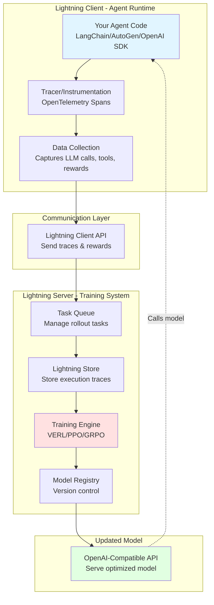
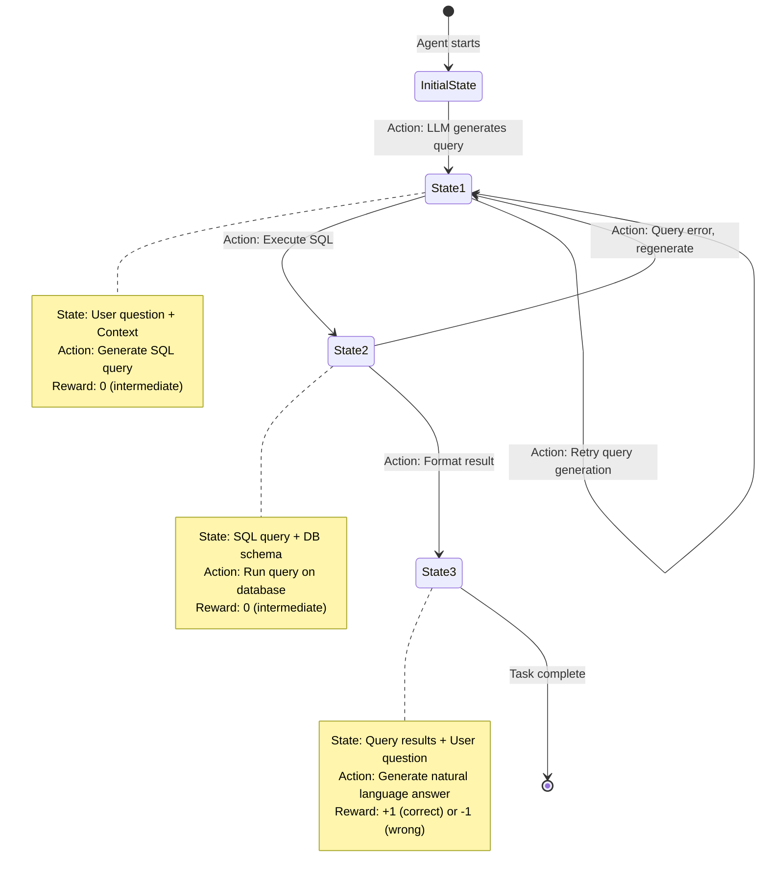
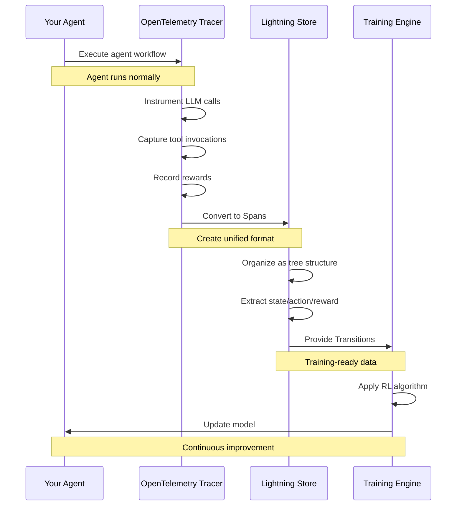
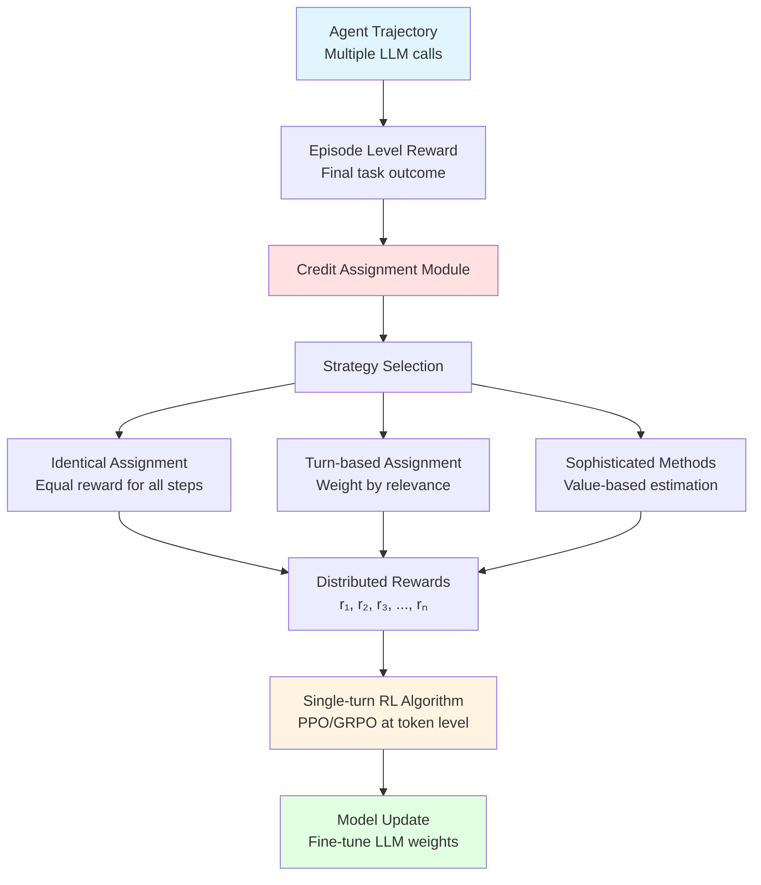

## Giới thiệu: Vấn đề mà chúng ta đang giải quyết

Bạn đã bao giờ xây dựng một AI agent sử dụng LangChain, AutoGen, hay OpenAI Agents SDK chưa? Nếu có, bạn có thể đã gặp phải một câu hỏi quan trọng: **Làm thế nào để agent của tôi học hỏi và cải thiện từ những trải nghiệm thực tế?**[1][2]

Trước đây, nếu muốn tối ưu hóa một AI agent bằng Reinforcement Learning (RL), bạn phải:
- Viết lại toàn bộ agent code để tích hợp với hệ thống training[2][1]
- Sử dụng sequence concatenation với masking phức tạp[1][2]
- Gắn chặt logic agent với training pipeline, khiến việc maintain trở nên khó khăn[3][1]

**Agent Lightning** từ Microsoft Research đã thay đổi hoàn toàn game này. Đây là framework đầu tiên cho phép bạn huấn luyện **BẤT KỲ AI agent nào** với RL mà **hầu như KHÔNG CẦN sửa code**.[4][5][6][2][1]

***

## Agent Lightning là gì?

Agent Lightning là một framework linh hoạt và mở rộng cho phép huấn luyện Large Language Models (LLMs) cho bất kỳ AI agent nào thông qua Reinforcement Learning. Điểm đặc biệt là nó đạt được **sự tách biệt hoàn toàn** (complete decoupling) giữa việc thực thi agent và quá trình training.[7][2][3][1]

### Tính năng nổi bật

🔌 **Plug-and-Play với mọi framework**: Hỗ trợ LangChain, OpenAI Agents SDK, AutoGen, CrewAI, hoặc thậm chí agent tự viết từ đầu[5][4][7][1]

💤 **Gần như không cần sửa code**: Chỉ cần thêm vài dòng code để enable tracing[8][4][5]

🎯 **Tối ưu hóa có chọn lọc**: Có thể chọn train một hoặc nhiều agents trong hệ thống multi-agent[4][7][5]

🤗 **Nhiều thuật toán**: Hỗ trợ Reinforcement Learning (PPO, GRPO), Automatic Prompt Optimization, Supervised Fine-tuning và nhiều hơn nữa[9][10][11][4]

---

## Kiến trúc cốt lõi của Agent Lightning

### 1. Training-Agent Disaggregation Architecture

Đây là kiến trúc quan trọng nhất giúp tách biệt agent execution khỏi RL training. Hệ thống bao gồm hai thành phần chính:[2][3][1]

#### **Lightning Server** (Teacher/Coach)
- Điều khiển quá trình RL training[3][1]
- Quản lý training process và version resources[12][3]
- Expose OpenAI-compatible API để agents có thể gọi model đã được update[6][1][3]
- Chạy trên GPU clusters để train models[8][12]

#### **Lightning Client** (Student/Runner)
- Chạy agent và thực hiện data collection[1][3]
- Handle communication với server để truyền và nhận dữ liệu[3][1]
- Hoạt động như agent runtime, transparently quản lý agent execution mà không cần sửa code[1][3]
- Có thể chạy trên CPU machines, scale độc lập với training[12][8]

**Workflow diagram đầy đủ:**



**Giải thích workflow:**
1. Agent của bạn chạy bình thường với framework quen thuộc (LangChain, AutoGen, etc.)
2. Tracer automatically instrument các LLM calls và tool invocations thành OpenTelemetry spans[13][14]
3. Data được collect và gửi về Lightning Server
4. Server train model bằng RL algorithms (PPO, GRPO)[10][11]
5. Model đã optimize được serve lại cho agent thông qua OpenAI-compatible API[6][1]

***

### 2. Markov Decision Process (MDP) Formulation

Agent Lightning model hóa agent execution như một Markov Decision Process để có thể áp dụng RL. Đây là nền tảng toán học cho phép framework hoạt động với bất kỳ agent nào.[15][2][3][1]

#### Các thành phần MDP trong Agent Lightning:

**State (Trạng thái)**: Snapshot hiện tại của agent execution, bao gồm các biến mô tả đầy đủ execution status[3][1]

**Action (Hành động)**: Output được generate bởi policy LLM, được dùng để update state[1][3]

**Reward (Phần thưởng)**: Signal đánh giá chất lượng của transition[16][3][1]

**Transition (Chuyển đổi)**: Tuple (state, action, reward, next_state) mô tả việc agent di chuyển giữa các states[17][3][1]

**MDP Flow trong Agent Lightning:**



***

### 3. Unified Data Interface

Đây là abstraction layer quan trọng giúp Agent Lightning hoạt động với bất kỳ agent framework nào. Interface này:[7][3][1]

- **Abstracts complexity** của các agent execution logic khác nhau[3][1]
- **Transforms data** được collect trong agent execution thành training trajectories[1][3]
- **Captures complete execution context** trong mỗi state[1]
- **Enables clean decoupling** giữa agent execution và RL training[3][1]

**Quy trình thu thập dữ liệu:**



***

### 4. LightningRL: Hierarchical RL Algorithm

LightningRL là thuật toán RL phân cấp được thiết kế đặc biệt cho agent scenarios. Điểm đặc biệt là **credit assignment module** cho phép decompose trajectories thành training transitions.[18][2][3][1]

#### Vấn đề Credit Assignment

Trong multi-turn agent interactions, làm sao biết **bước nào** trong chuỗi hành động đã contribute vào kết quả cuối cùng?[19][20]

**Ví dụ:** Agent thực hiện 10 bước để giải quyết một bài toán:
- Bước 3 và 7 rất quan trọng dẫn đến success
- Bước 1, 5, 9 ít contribute hơn
- Các bước còn lại là neutral

→ Credit assignment module phải phân phối reward từ final outcome về từng bước một cách hợp lý[17][19][3]

**Credit Assignment và Integration với Single-turn RL:**



#### Chiến lược Credit Assignment

Agent Lightning hỗ trợ nhiều strategies:[21][19][3]

**1. Identical Assignment**: Mọi LLM invocation nhận reward bằng nhau[10][16]

**2. Turn-based với Relevance Factor**: Non-terminal turns nhận combination của immediate reward và weighted final reward[19]

**3. Sophisticated Methods**: Value function estimation, temporal difference learning[19]

#### Integration với Single-turn RL

Sau khi credit assignment, mỗi LLM invocation được treat như independent single-turn RL problem:[21][3]
1. Credit assignment phân phối episode-level reward về từng step
2. Mỗi step trở thành một training sample
3. Apply existing efficient single-turn RL algorithms (PPO, GRPO)[11][22][10]
4. Update model weights based on assigned credits

***

## So sánh: Traditional Approach vs Agent Lightning

### Traditional Approach
- Tightly couple RL training với agent code[2][1]
- Phải rewrite cho mỗi framework[2][1]
- Sequence concatenation với masking phức tạp[2][1]
- Khó maintain và scale[2][1]

### Agent Lightning Approach
- Complete decoupling giữa agent và training[2][3][1]
- Gần như zero code modifications[5][4][1][2]
- Works với bất kỳ framework nào[4][7][1]
- Independent scaling (CPU rollout + GPU training)[8][12]

***

## Ví dụ thực tế: Integrate Agent Lightning

### Bước 1: Agent code gốc (LangChain)

```python
from langchain.agents import create_react_agent
from langchain_openai import ChatOpenAI
from langchain.tools import Tool

# Your existing agent - NO CHANGES NEEDED
llm = ChatOpenAI(model="gpt-4")
tools = [
    Tool(name="Calculator", func=calculator_func, description="Do math"),
    Tool(name="Search", func=search_func, description="Search web")
]

agent = create_react_agent(llm, tools)
```

### Bước 2: Add Agent Lightning

```python
from agentlightning import LightningClient, OtelTracer

# Create Lightning Client
client = LightningClient(
    server_url="http://localhost:8000",
    rollout_id="my_rollout"
)

# Add tracer for automatic instrumentation
tracer = OtelTracer(enable_otel=True)

# Wrap your agent execution
async with tracer.trace_context(
    name="langchain-agent",
    store=client.store,
    rollout_id=client.rollout_id,
    attempt_id="attempt_1"
):
    result = agent.invoke({"input": "What's 25 * 17?"})
    
    # Emit reward based on correctness
    if verify_result(result):
        tracer.emit_reward(reward=1.0)
    else:
        tracer.emit_reward(reward=-1.0)
```

### Bước 3: Configure training

```python
from agentlightning.trainer import Trainer
from agentlightning.algorithm.verl import VERL

algorithm = VERL(config={
    "algorithm": {
        "adv_estimator": "grpo",
        "use_kl_in_reward": False,
    },
    "data": {
        "train_batch_size": 32,
        "max_prompt_length": 4096,
        "max_response_length": 2048,
    }
})

trainer = Trainer(algorithm=algorithm, n_workers=4)
trainer.fit(agent=your_agent, backend="http://localhost:8000")
```

**Đó là tất cả!** Agent của bạn giờ đã có thể học và cải thiện từ experience.[5][4][8][1]

***

## Experiments và Results

Agent Lightning đã được test trên nhiều real-world tasks:[7][1][2]

**Text-to-SQL (Spider)**: LangGraph SQL agent với selective optimization, significant accuracy improvement[12]

**Retrieval-Augmented Generation**: Optimize retrieval và answer generation, stable continuous improvements[1][2]

**Math Tool-Use (Calc-X)**: RL on correctness rewards, effective credit assignment trong multi-step reasoning[12]

**Key Findings**: Stable training, continuous improvement, scalable to production[7][2][1]

***

## Khi nào nên sử dụng Agent Lightning?

### ✅ Suitable for:

- Production agents cần continuous improvement
- Complex multi-turn workflows với tool use
- Khi bạn đã có agent code working và không muốn rewrite

### ❌ Có thể không phù hợp:

- Simple single-turn tasks
- Không có reward signal rõ ràng
- Resource constraints (không có GPU infrastructure)

***

## Best Practices

**Reward Design**: Sử dụng verifiable rewards, combine terminal + intermediate rewards, start simple[16][17][19][12]

**Data Collection**: Collect diverse experiences, run parallel rollout workers, monitor quality[23][8][12]

**Training Strategy**: Start với pre-trained models, use established algorithms (PPO/GRPO), monitor metrics[22][11][10]

---

## Roadmap và Future Work

Microsoft Research đang plan nhiều improvements:[24][21]

**Đã có**: RL training với PPO/GRPO, Automatic Prompt Optimization, Supervised Fine-tuning, Multi-agent training[9][11][10][4][5][7]

**Đang phát triển**: Richer feedback mechanisms, Off-policy algorithms, Curriculum learning, Training-free optimizations, More sophisticated credit assignment[24][21]

---

## Kết luận

Agent Lightning đại diện cho một **paradigm shift** trong cách chúng ta train và optimize AI agents. Bằng cách decoupling hoàn toàn agent execution khỏi training system, sử dụng MDP formulation và unified data interface, áp dụng hierarchical RL với intelligent credit assignment, và leverage observability frameworks, framework này enables developers để transform existing agents thành learning systems với minimal effort.[14][18][13][6][4][5][3][2][1]

**Cho beginner developers**: Agent Lightning lower barrier to entry cho agent optimization. Bạn không cần phải là RL expert để benefit từ reinforcement learning cho LLMs.

**Cho experienced engineers**: Framework cung cấp flexibility và extensibility để customize theo specific needs.

***

## Resources

**Official Links**:
- GitHub: https://github.com/microsoft/agent-lightning
- Research Paper: https://arxiv.org/abs/2508.03680
- Documentation: https://microsoft.github.io/agent-lightning/
- Microsoft Research: https://www.microsoft.com/en-us/research/project/agent-lightning/

**Getting Started**:
```bash
pip install agentlightning
git clone https://github.com/microsoft/agent-lightning.git
```

***

Agent Lightning mở ra possibilities mới cho AI agent development. Thay vì accept agents with static capabilities, chúng ta giờ có tools để build agents that **learn, adapt, and improve** từ real-world experiences - và quan trọng nhất, làm điều này **without rewriting existing code**.[4][5][2][1]

Nếu bạn đang build AI agents, đây là thời điểm tuyệt vời để explore Agent Lightning và xem nó có thể elevate agent capabilities của bạn như thế nào!của bạn như thế nào!

[1](https://arxiv.org/html/2508.03680)
[2](https://arxiv.org/abs/2508.03680)
[3](https://arxiv.org/html/2508.03680v1)
[4](https://microsoft.github.io/agent-lightning/latest/)
[5](https://github.com/microsoft/agent-lightning)
[6](https://www.microsoft.com/en-us/research/project/agent-lightning/)
[7](https://huggingface.co/papers/2508.03680)
[8](https://www.theunwindai.com/p/train-ai-agents-with-rl-no-code-changes)
[9](https://aiengineering.beehiiv.com/p/train-ai-agents-with-rl-agent-lightning-from-microsoft)
[10](https://microsoft.github.io/agent-lightning/stable/algorithm-zoo/verl/)
[11](https://github.com/volcengine/verl)
[12](https://joshuaberkowitz.us/blog/github-repos-8/agent-lightning-decoupled-rl-training-for-any-ai-agent-975)
[13](https://microsoft.github.io/agent-lightning/stable/tutorials/traces/)
[14](https://docs.koog.ai/opentelemetry-support/)
[15](https://www.geeksforgeeks.org/machine-learning/markov-decision-process/)
[16](https://news.aibase.com/news/22378)
[17](https://www.marktechpost.com/2025/10/29/microsoft-releases-agent-lightning-a-new-ai-framework-that-enables-reinforcement-learning-rl-based-training-of-llms-for-any-ai-agent/)
[18](https://chatpaper.com/paper/173395)
[19](https://hlfshell.ai/posts/multi-turn-credit-assignment/)
[20](https://discovery.ucl.ac.uk/id/eprint/10211495/1/Pignatelli_10211495_Thesis.pdf)
[21](https://www.youtube.com/watch?v=SNPZy3sAv2Q)
[22](https://verl.readthedocs.io/en/latest/algo/grpo.html)
[23](https://lifetime.fi/blog/Lightning)
[24](https://nielsberglund.com/post/2025-11-02-interesting-stuff---week-44-2025/)
[25](https://docs.langchain.com/langsmith/autogen-integration)
[26](https://www.linkedin.com/posts/skphd_agent-lightning-activity-7360485368950870016-qK7a)
[27](https://www.facebook.com/groups/ainocode/posts/846923091419146/)
[28](https://developer.nvidia.com/blog/building-an-interactive-ai-agent-for-lightning-fast-machine-learning-tasks/)
[29](https://www.linkedin.com/pulse/agent-lightning-supercharging-ai-agents-engineers-khanchandani-4jqxc)
[30](https://news.ycombinator.com/item?id=45706729)
[31](https://pub.towardsai.net/agent-lightning-revolutionizing-ai-agent-training-with-reinforcement-learning-885bc78daa2c)
[32](https://www.alphaxiv.org/overview/2508.03680v1)
[33](https://prezi.com/p/itmehoebt1jw/agent-lightning-training-ai-agents-with-reinforcement-learning/)
[34](https://www.reddit.com/r/singularity/comments/1oj95ji/agent_lightning_train_any_ai_agents_with/)
[35](https://introml.mit.edu/notes/mdp.html)
[36](https://gibberblot.github.io/rl-notes/single-agent/MDPs.html)
[37](https://en.wikipedia.org/wiki/Markov_decision_process)
[38](https://learn.microsoft.com/en-us/agent-framework/user-guide/agents/agent-observability)
[39](https://outshift.cisco.com/blog/ai-observability-multi-agent-systems-opentelemetry)
[40](https://lightning.ai/lightning-ai/environments/training-a-coding-agent-with-verl)
[41](https://opentelemetry.io/blog/2025/ai-agent-observability/)
[42](https://opentelemetry.io/docs/concepts/observability-primer/)
[43](https://github.com/langfengQ/verl-agent)
[44](https://mcp-builder.ai/mcp-training-center/build-ai-agent-langchain-mcp)
[45](https://www.codecademy.com/article/agentic-ai-with-langchain-langgraph)
[46](https://github.com/OpenAccess-AI-Collective/axolotl/issues/128)
[47](https://docs.langchain.com/oss/python/langchain/agents)
[48](https://github.com/NVIDIA/NeMo/issues/9664)
[49](https://dilipa.github.io/papers/info_credit.pdf)
[50](https://dev.to/pavanbelagatti/build-a-real-time-news-ai-agent-using-langchain-in-just-a-few-steps-4d60)
[51](https://openreview.net/pdf/6718149705ee4f6bfffcce1d48be9f6ad3679247.pdf)
[52](https://www.langchain.com)
[53](https://arxiv.org/html/2509.06733v1)
[54](https://arxiv.org/html/2510.00023v1)
[55](https://arxiv.org/html/2510.10991v1)
[56](https://arxiv.org/abs/2401.03568)
[57](https://arxiv.org/html/2508.11553v1)
[58](https://arxiv.org/pdf/2404.11584.pdf)
[59](https://www.facebook.com/asifrazzaq1988/photos/microsoft-releases-agent-lightning-a-new-ai-framework-that-enables-reinforcement/3306146439523410/)
[60](https://arxiv.org/html/2510.16720v1)
[61](https://arxiv.org/pdf/2407.01502.pdf)
[62](https://arxiv.org/html/2509.02547v1)
[63](https://www.mathworks.com/help/reinforcement-learning/ug/train-reinforcement-learning-agent-in-mdp-environment.html)
[64](https://apxml.com/courses/intro-to-reinforcement-learning/chapter-2-markov-decision-processes-mdps/reward-functions)
[65](https://pantelis.github.io/aiml-common/lectures/mdp/mdp-intro/)
[66](https://www.reddit.com/r/machinelearningnews/comments/1ojhlma/microsoft_releases_agent_lightning_a_new_ai/)
[67](https://www.linkedin.com/posts/mayank-sultania-2ab9a514b_agentlightning-aiagents-tech2025-activity-7367420824628183041-kNvm)
[68](https://neptune.ai/blog/markov-decision-process-in-reinforcement-learning)
[69](https://blog.vllm.ai/2025/10/22/agent-lightning.html)
[70](https://inst.eecs.berkeley.edu/~cs188/textbook/mdp/markov-decision-processes.html)
[71](https://www.marktechpost.com/2025/08/31/step-by-step-guide-to-ai-agent-development-using-microsoft-agent-lightning/)
[72](https://www.reinforcementlearningpath.com/markov-decision-process-mdp-application-1/)