# Deep Dive: Hybrid Memory Search Architecture trong OpenClaw

> Bài viết phân tích chuyên sâu kiến trúc Memory Search của OpenClaw -- hệ thống kết hợp Vector Search (semantic) và Full-Text Search (BM25) để tạo ra một bộ nhớ dài hạn thông minh cho AI agent. Dành cho developer muốn hiểu cách xây dựng Retrieval-Augmented Generation (RAG) system trong thực tế production.

---

## Mục lục

1. [Vấn đề cần giải quyết](#1-vấn-đề-cần-giải-quyết)
2. [Kiến trúc tổng quan](#2-kiến-trúc-tổng-quan)
3. [Giai đoạn 0: Ingestion Pipeline](#3-giai-đoạn-0-ingestion-pipeline)
4. [Giai đoạn 1: Dual Search -- Vector + FTS](#4-giai-đoạn-1-dual-search----vector--fts)
5. [Giai đoạn 2: Score Fusion -- Weighted Sum](#5-giai-đoạn-2-score-fusion----weighted-sum)
6. [Giai đoạn 3: Post-Processing](#6-giai-đoạn-3-post-processing)
7. [SQLite Schema -- Ba bảng, hai virtual table](#7-sqlite-schema----ba-bảng-hai-virtual-table)
8. [Embedding Provider System](#8-embedding-provider-system)
9. [Sync Lifecycle & Atomic Reindex](#9-sync-lifecycle--atomic-reindex)
10. [Session Memory & Pre-Compaction Flush](#10-session-memory--pre-compaction-flush)
11. [Fallback Architecture](#11-fallback-architecture)
12. [Sơ đồ kiến trúc hoàn chỉnh](#12-sơ-đồ-kiến-trúc-hoàn-chỉnh)
13. [Lessons Learned & Trade-offs](#13-lessons-learned--trade-offs)

---

## 1. Vấn đề cần giải quyết

AI agent xử lý conversation trong context window có giới hạn. Khi conversation kéo dài, các thông tin quan trọng bị mất do compaction. Memory system giải quyết bài toán này: **duy trì kiến thức dài hạn bằng cách lưu thông tin ra file Markdown, rồi tìm kiếm lại khi cần**.

Nhưng "tìm kiếm" không đơn giản. Có hai kiểu tìm kiếm bổ sung cho nhau:

- **Semantic search** (vector): "Tìm nội dung liên quan đến thanh toán" -- hiểu *nghĩa*, không cần match chính xác từ.
- **Keyword search** (FTS): "payment_processor" -- match chính xác tên biến, tên hàm, thuật ngữ kỹ thuật.

Mỗi kiểu có điểm mạnh riêng. Hybrid search kết hợp cả hai.

---

## 2. Kiến trúc tổng quan

Toàn bộ hệ thống Memory nằm trong `src/memory/` với khoảng 40 file TypeScript. Entry point là `MemoryIndexManager` -- một singleton per-agent, cached theo key `agentId:workspaceDir:settingsHash`.

```
                    ┌──────────────────────────────┐
                    │     MemoryIndexManager        │
                    │  (singleton per agent config) │
                    └──────────┬───────────────────┘
                               │
              ┌────────────────┼────────────────┐
              │                │                │
    ┌─────────▼──────┐  ┌─────▼──────┐  ┌──────▼───────┐
    │  Ingestion      │  │   Search    │  │  Lifecycle   │
    │  Pipeline       │  │   Engine    │  │  Management  │
    │                 │  │             │  │              │
    │ - File watcher  │  │ - Vector    │  │ - Sync       │
    │ - Chunking      │  │ - FTS/BM25  │  │ - Reindex    │
    │ - Embedding     │  │ - Fusion    │  │ - Flush      │
    │ - Caching       │  │ - Filtering │  │ - Cleanup    │
    └─────────────────┘  └────────────┘  └──────────────┘
              │                │                │
              └────────────────┼────────────────┘
                               │
                    ┌──────────▼───────────────┐
                    │     SQLite Database       │
                    │                           │
                    │ tables: meta, files,      │
                    │         chunks,           │
                    │         embedding_cache   │
                    │ virtual: chunks_fts (FTS5)│
                    │          chunks_vec (vec0)│
                    └───────────────────────────┘
```

---

## 3. Giai đoạn 0: Ingestion Pipeline

Trước khi search được, dữ liệu phải được **ingest** vào database. Đây là pipeline đầy đủ:

### 3.1 Thu thập file nguồn

```
listMemoryFiles(workspaceDir)
    │
    ├── MEMORY.md          (workspace root)
    ├── memory.md          (alternative)
    ├── memory/**/*.md     (recursive walk)
    └── extraPaths (config) (absolute or relative)

    Filter: chỉ .md, bỏ qua symlinks
    Dedup: theo realpath
```

Hệ thống cũng index **session transcripts** -- file `.jsonl` chứa lịch sử conversation, nằm tại `~/.openclaw/agents/<agentId>/sessions/`.

### 3.2 Chunking: Chia văn bản thành đoạn

File `internal.ts` -- hàm `chunkMarkdown()`:

```typescript
// Default config
chunking: {
  tokens: 400,    // target chunk size
  overlap: 80     // overlap giữa 2 chunk liên tiếp
}
```

**Thuật toán:**

1. Quy đổi token → char: `maxChars = tokens * 4 = 1600 chars`, `overlapChars = overlap * 4 = 320 chars`
2. Duyệt từng dòng, tích lũy vào buffer hiện tại
3. Khi buffer vượt `maxChars` → flush thành 1 chunk
4. Sau flush, giữ lại các dòng cuối (tổng ≤ `overlapChars`) làm overlap cho chunk tiếp theo
5. Dòng quá dài → cắt thành segments `maxChars` ký tự

Mỗi chunk lưu: `startLine`, `endLine`, `text`, `hash` (SHA-256 của text).

**Tại sao overlap?** Để tránh mất ngữ cảnh ở biên chunk. Nếu một ý nằm trải qua ranh giới giữa 2 chunk, overlap đảm bảo nó xuất hiện đầy đủ ở ít nhất 1 chunk.

### 3.3 Embedding: Chuyển text → vector

Mỗi chunk text được gửi qua embedding provider để tạo vector số thực:

```
"Lỗi xử lý thanh toán khi amount = 0"
        │
        ▼
  Embedding API (OpenAI / Gemini / Voyage / Local)
        │
        ▼
  [0.012, -0.034, 0.089, ..., 0.001]  ← N chiều (thay đổi theo model)
        │
        ▼
  sanitizeAndNormalizeEmbedding()
    - NaN/Infinity → 0
    - L2 normalize to unit length
```

**Embedding cache**: Trước khi gọi API, hệ thống kiểm tra bảng `embedding_cache` theo key `(provider, model, provider_key, hash)`. Nếu text không đổi (cùng SHA-256 hash) và cùng provider config → dùng lại embedding cũ, tiết kiệm API call.

### 3.4 Lưu trữ

Mỗi chunk được lưu vào 3 nơi đồng thời:

```
1. chunks table     ← text + JSON embedding + metadata
2. chunks_vec       ← Float32Array blob (cho sqlite-vec vector search)
3. chunks_fts       ← text (cho FTS5 keyword search)
```

---

## 4. Giai đoạn 1: Dual Search -- Vector + FTS

Khi user query đến, hai search engine chạy **song song**:

### 4.1 Vector Search (Semantic)

File `manager-search.ts` -- hàm `searchVector()`:

```
User Query: "Lỗi logic code xử lý thanh toán"
    │
    ▼
embedQuery(text)  ← cùng embedding provider đã dùng lúc index
    │
    ▼
queryVec: [0.023, -0.045, ...]
    │
    ▼
┌─ Path A: sqlite-vec available ──────────────────────────┐
│  SQL:                                                     │
│  SELECT c.*, vec_distance_cosine(v.embedding, ?) AS dist │
│  FROM chunks_vec v JOIN chunks c ON c.id = v.id          │
│  WHERE c.model = ?                                        │
│  ORDER BY dist ASC  LIMIT ?                               │
│                                                           │
│  score = 1 - dist  (cosine distance → similarity)        │
└──────────────────────────────────────────────────────────┘
    │
    │ (fallback nếu sqlite-vec không load được)
    ▼
┌─ Path B: JS fallback ───────────────────────────────────┐
│  Load ALL chunks from DB                                  │
│  Parse JSON embeddings                                    │
│  Compute cosineSimilarity() in JavaScript                │
│  Sort + take top-N                                        │
│  (chậm nhưng luôn hoạt động)                             │
└──────────────────────────────────────────────────────────┘
```

**Cosine Similarity** đo sự tương đồng về ngữ nghĩa giữa hai vector:

```typescript
// internal.ts
function cosineSimilarity(a: number[], b: number[]): number {
  // dot(a,b) / (||a|| * ||b||)
  // Range: -1 (opposite) to 1 (identical)
  // Do vectors đã L2-normalized nên dot product = cosine similarity
}
```

### 4.2 Keyword Search (FTS/BM25)

File `hybrid.ts` -- hàm `buildFtsQuery()` + file `manager-search.ts` -- hàm `searchKeyword()`:

**Bước 1: Tokenization (đơn giản)**

```typescript
// hybrid.ts
function buildFtsQuery(raw: string): string | null {
  const tokens = raw.match(/[A-Za-z0-9_]+/g);  // regex, không phải NLP tokenizer
  const quoted = tokens.map(t => `"${t}"`);
  return quoted.join(" AND ");
}

// Input:  "Lỗi logic code xử lý thanh toán"
// Output: "logic" AND "code" AND "thanh" AND "to" AND "n"
// (Lưu ý: regex chỉ lấy [A-Za-z0-9_], Unicode chars bị loại)
```

**Bước 2: FTS5 BM25 query**

```sql
SELECT id, path, source, start_line, end_line, text,
       bm25(chunks_fts) AS rank
  FROM chunks_fts
 WHERE chunks_fts MATCH '"logic" AND "code"'
   AND model = ?
 ORDER BY rank ASC    -- BM25: lower = better match
 LIMIT ?
```

**Bước 3: Rank → Score normalization**

```typescript
// hybrid.ts
function bm25RankToScore(rank: number): number {
  const normalized = Number.isFinite(rank) ? Math.max(0, rank) : 999;
  return 1 / (1 + normalized);
  // rank=0 → score=1.0 (best)
  // rank=1 → score=0.5
  // rank=9 → score=0.1
  // Asymptotically approaches 0
}
```

### 4.3 Candidate Pool

Cả hai search đều fetch nhiều hơn số kết quả cần thiết:

```
candidateMultiplier = 4  (default)
maxResults = 6           (default)

→ Mỗi search engine fetch: min(200, max(1, 6 * 4)) = 24 candidates
```

Mục đích: tạo pool đủ lớn để fusion algorithm có "nguyên liệu" chất lượng.

---

## 5. Giai đoạn 2: Score Fusion -- Weighted Sum

File `hybrid.ts` -- hàm `mergeHybridResults()`:

**Quan trọng: Đây là Weighted Sum, KHÔNG PHẢI Reciprocal Rank Fusion (RRF).**

```
Vector Results:  [{id: "c1", vectorScore: 0.92}, {id: "c2", vectorScore: 0.85}, ...]
Keyword Results: [{id: "c2", textScore: 0.78}, {id: "c5", textScore: 0.65}, ...]
                          │
                          ▼
              ┌───────────────────────┐
              │   Merge by chunk ID   │
              └───────────┬───────────┘
                          │
        ┌─────────────────┼─────────────────┐
        │                 │                 │
  id="c1"           id="c2"           id="c5"
  vec=0.92          vec=0.85          vec=0.00  ← chỉ có keyword
  text=0.00         text=0.78         text=0.65
  (chỉ có vector)   (có cả hai)
        │                 │                 │
        ▼                 ▼                 ▼
  score = 0.7*0.92   0.7*0.85          0.7*0.00
        + 0.3*0.00   + 0.3*0.78        + 0.3*0.65
        = 0.644      = 0.829           = 0.195
```

**Thuật toán chi tiết:**

```typescript
function mergeHybridResults({ vector, keyword, vectorWeight, textWeight }) {
  const byId = new Map();

  // 1. Insert tất cả vector results, textScore = 0
  for (const r of vector) {
    byId.set(r.id, { ...r, vectorScore: r.vectorScore, textScore: 0 });
  }

  // 2. Merge keyword results
  for (const r of keyword) {
    const existing = byId.get(r.id);
    if (existing) {
      existing.textScore = r.textScore;  // ← chunk có cả 2 signals
    } else {
      byId.set(r.id, { ...r, vectorScore: 0, textScore: r.textScore });
    }
  }

  // 3. Compute final score
  return Array.from(byId.values())
    .map(entry => ({
      ...entry,
      score: vectorWeight * entry.vectorScore + textWeight * entry.textScore
    }))
    .toSorted((a, b) => b.score - a.score);  // descending
}
```

**Tại sao Weighted Sum mà không phải RRF?**

Project docs thừa nhận: *"This is not IR-theory perfect. RRF or score normalization would be potential future improvements."* Weighted Sum đơn giản, nhanh, dễ debug, và đủ tốt cho use case memory recall. Trade-off có ý thức.

### Phân tích ưu/nhược

| Weighted Sum | RRF |
|---|---|
| Đơn giản, O(n) | Phức tạp hơn, cần rank position |
| Phụ thuộc vào scale của score | Bất biến với score scale |
| Cần score calibrated tốt | Chỉ cần rank order |
| Fast, no overhead | Thêm 1 pass sort mỗi list |

Trong context này, cả vectorScore (cosine similarity, range 0-1) và textScore (BM25 normalized, range 0-1) đã được normalize về cùng range, nên Weighted Sum hoạt động ổn.

---

## 6. Giai đoạn 3: Post-Processing

Sau fusion, kết quả đi qua 2 bộ lọc:

```
Merged results (sorted by score descending)
    │
    ▼
Filter: score >= minScore (default: 0.35)
    │
    ▼
Limit: top maxResults (default: 6)
    │
    ▼
Truncate snippet: max 700 chars (SNIPPET_MAX_CHARS)
    │
    ▼
Return MemorySearchResult[] {
  path, startLine, endLine,
  score (0-1), snippet, source,
  citation? ("path#L5-L20")
}
```

---

## 7. SQLite Schema -- Ba bảng, hai virtual table

File `memory-schema.ts`:

```
┌──────────────────────────────────────────────────────────┐
│                     SQLite Database                       │
│              (~/.openclaw/memory/{agentId}.sqlite)        │
│                                                           │
│  ┌──────────────────────────────────────────────────┐    │
│  │ meta (key-value store)                           │    │
│  │   key: "memory_index_meta_v1"                    │    │
│  │   value: {model, provider, vectorDims, ...}      │    │
│  └──────────────────────────────────────────────────┘    │
│                                                           │
│  ┌──────────────────────────────────────────────────┐    │
│  │ files (tracks indexed source files)              │    │
│  │   path TEXT PK, source, hash, mtime, size        │    │
│  └──────────────────────────────────────────────────┘    │
│                                                           │
│  ┌──────────────────────────────────────────────────┐    │
│  │ chunks (text + embedding data)                   │    │
│  │   id TEXT PK, path, source, start_line,          │    │
│  │   end_line, hash, model, text,                   │    │
│  │   embedding TEXT (JSON number[]),                 │    │
│  │   updated_at                                      │    │
│  │   INDEX: idx_chunks_path, idx_chunks_source      │    │
│  └──────────────────────────────────────────────────┘    │
│                                                           │
│  ┌──────────────────────────────────────────────────┐    │
│  │ embedding_cache (avoid re-embedding)             │    │
│  │   PK: (provider, model, provider_key, hash)      │    │
│  │   embedding TEXT, dims INT, updated_at            │    │
│  └──────────────────────────────────────────────────┘    │
│                                                           │
│  ┌──────────────────────────────────────────────────┐    │
│  │ chunks_fts (FTS5 virtual table)                  │    │
│  │   text (indexed), id/path/source/model/          │    │
│  │   start_line/end_line (UNINDEXED)                │    │
│  │   ⚠️ Created conditionally, graceful degradation │    │
│  └──────────────────────────────────────────────────┘    │
│                                                           │
│  ┌──────────────────────────────────────────────────┐    │
│  │ chunks_vec (vec0 via sqlite-vec extension)       │    │
│  │   id TEXT PK, embedding FLOAT[N]                 │    │
│  │   N = dims from embedding provider               │    │
│  │   ⚠️ Created lazily when dims known              │    │
│  │   ⚠️ Dropped & recreated if dims change          │    │
│  └──────────────────────────────────────────────────┘    │
│                                                           │
└──────────────────────────────────────────────────────────┘
```

**Key insight:** Embedding lưu ở **hai nơi**: `chunks.embedding` là JSON string (cho JS fallback), `chunks_vec.embedding` là Float32Array blob (cho sqlite-vec accelerated search). Redundancy có chủ đích.

---

## 8. Embedding Provider System

File `embeddings.ts` -- Hệ thống multi-provider với auto-selection:

```
Provider Selection (provider = "auto")
    │
    ├── 1. Local (node-llama-cpp + GGUF model)
    │     ├── Kiểm tra: modelPath configured + file exists on disk?
    │     ├── Default model: embeddinggemma-300M-Q8_0.gguf (~0.6GB)
    │     └── Ưu điểm: không cần API key, chạy offline
    │
    ├── 2. OpenAI
    │     ├── Model: text-embedding-3-small
    │     ├── Endpoint: /v1/embeddings
    │     └── Cần: OPENAI_API_KEY
    │
    ├── 3. Gemini
    │     ├── Model: gemini-embedding-001
    │     ├── Phân biệt: taskType "RETRIEVAL_QUERY" vs "RETRIEVAL_DOCUMENT"
    │     └── Cần: GEMINI_API_KEY
    │
    └── 4. Voyage
          ├── Model: voyage-4-large
          ├── Phân biệt: input_type "query" vs "document"
          └── Cần: VOYAGE_API_KEY

Nếu tất cả fail → throw aggregated error
```

**Fallback mechanism:** Nếu primary provider fail, config `fallback` (e.g., `"openai"`) sẽ tự động kick in. Ngoài ra có runtime fallback -- nếu embedding errors xảy ra giữa sync, hệ thống tự thử provider khác.

**Batch embedding APIs:** Cho indexing lớn, hệ thống hỗ trợ async batch processing qua OpenAI/Gemini/Voyage Batch API (max 50,000 requests/batch). Có failure tracking: sau 2 batch failures → disable batch, fall back to inline embedding.

---

## 9. Sync Lifecycle & Atomic Reindex

### 9.1 Sync triggers

```
File watcher (chokidar, debounce 1.5s)
          │
Session transcript event (debounce 5s)
          │
Search request (if dirty + sync.onSearch = true)
          │
Session start (if sync.onSessionStart = true)
          │
Interval timer (configurable)
          │
          ▼
     runSync() ← coalesced (chỉ 1 sync chạy tại 1 thời điểm)
```

### 9.2 Incremental vs Full Reindex

```
runSync()
    │
    ├── Check meta: model/provider/chunking params changed?
    │     │
    │     ├── YES → runSafeReindex() (atomic full reindex)
    │     │
    │     └── NO → Incremental sync
    │           ├── Compare file hashes: chỉ re-index files đã thay đổi
    │           ├── Delete chunks của files đã xóa
    │           └── Embed new/changed chunks (with cache lookup)
    │
    ▼
  Done
```

### 9.3 Atomic Reindex -- Crash-safe

```
runSafeReindex()
    │
    ├── 1. Tạo temp SQLite DB (temp file)
    ├── 2. Index toàn bộ vào temp DB
    ├── 3. Seed embedding cache từ old DB (tránh re-embed)
    ├── 4. Đổi tên: current → backup, temp → current
    ├── 5. Mở DB mới, verify
    ├── 6. Xóa backup
    │
    └── Nếu fail ở bước 4-5:
          └── Rollback: backup → current
```

Đây là pattern chuẩn trong database: **write-ahead with swap**. Tránh tình trạng DB corrupt nếu process crash giữa chừng.

---

## 10. Session Memory & Pre-Compaction Flush

### 10.1 Session Transcript Indexing

```
Session .jsonl file
    │
    ▼
Parse each line → filter type="message"
    │
    ▼
Extract user/assistant text content
    │
    ▼
Normalize whitespace + redact sensitive data
    │
    ▼
Format: "User: ..." / "Assistant: ..."
    │
    ▼
chunkMarkdown() → embed → store (source="sessions")
```

**Delta-based sync:** Không reindex toàn bộ session file mỗi lần. Theo dõi `lastSize`, `pendingBytes`, `pendingMessages`. Chỉ sync khi vượt ngưỡng:
- `deltaBytes >= 100KB` HOẶC
- `deltaMessages >= 50 messages`

### 10.2 Pre-Compaction Memory Flush

Khi conversation gần hết context window:

```
totalTokens >= contextWindow - reserveTokensFloor(20K) - softThresholdTokens(4K)
    │
    ▼
Inject prompt: "Hãy lưu thông tin quan trọng vào memory file"
    │
    ▼
Agent writes to MEMORY.md / memory/YYYY-MM-DD.md
    │
    ▼
File watcher triggers sync → index new content
    │
    ▼
Context compaction proceeds (old messages trimmed)
    │
    ▼
Agent có thể recall thông tin đã flush qua memory_search tool
```

Đây là cơ chế **durable memory** -- biến context ephemeral thành persistent storage.

---

## 11. Fallback Architecture

OpenClaw có fallback ở **3 tầng**:

```
Tầng 1: Backend Fallback
┌───────────────────────────────┐
│  QMD Backend (external tool)  │
│  BM25 + Vector + Reranking    │
└──────────┬────────────────────┘
           │ fail
           ▼
┌───────────────────────────────┐
│  Builtin MemoryIndexManager   │
│  (luôn available)             │
└───────────────────────────────┘

Tầng 2: Embedding Provider Fallback
┌──────────┐    ┌──────────┐    ┌──────────┐    ┌──────────┐
│  OpenAI  │ →  │  Gemini  │ →  │  Voyage  │ →  │  Local   │
└──────────┘    └──────────┘    └──────────┘    └──────────┘

Tầng 3: Vector Search Fallback
┌──────────────────────┐
│ sqlite-vec extension │
│ vec_distance_cosine()│
└──────────┬───────────┘
           │ extension not loaded
           ▼
┌──────────────────────┐
│ JS cosineSimilarity()│
│ (load ALL chunks,    │
│  compute in-memory)  │
└──────────────────────┘
```

Thiết kế này đảm bảo memory search **luôn hoạt động** dù environment thiếu dependencies.

---

## 12. Sơ đồ kiến trúc hoàn chỉnh

```mermaid
graph TD
    %% ═══════════════════════════════════════════
    %% INGESTION PIPELINE (Giai đoạn 0)
    %% ═══════════════════════════════════════════

    subgraph "GIAI ĐOẠN 0: INGESTION PIPELINE"
        direction TB

        MemFiles["Memory Files (.md)<br/>MEMORY.md, memory/*.md"]
        SessionFiles["Session Transcripts (.jsonl)<br/>~/.openclaw/agents/*/sessions/"]

        subgraph "File Discovery"
            Watcher["Chokidar File Watcher<br/>debounce 1.5s"]
            SessionEvent["Session Transcript Event<br/>debounce 5s"]
            DeltaCheck{"Delta Check<br/>≥100KB hoặc ≥50 messages?"}
        end

        subgraph "Chunking"
            ChunkFn["chunkMarkdown()<br/>tokens=400, overlap=80<br/>maxChars=1600, overlapChars=320"]
            Chunks["Chunks[]<br/>{startLine, endLine, text, hash(SHA-256)}"]
        end

        subgraph "Embedding"
            CacheCheck{"Embedding Cache<br/>Lookup by (provider, model,<br/>provider_key, hash)"}
            EmbedAPI["Embedding Provider<br/>auto: local→openai→gemini→voyage"]
            Normalize["sanitizeAndNormalizeEmbedding()<br/>NaN→0, L2 normalize"]
            EmbedCache["Store in embedding_cache"]
        end

        subgraph "Storage (3 targets)"
            ChunksTable["chunks table<br/>text + JSON embedding"]
            VecTable["chunks_vec (sqlite-vec)<br/>Float32Array blob"]
            FtsTable["chunks_fts (FTS5)<br/>indexed text"]
        end

        MemFiles --> Watcher
        SessionFiles --> SessionEvent
        SessionEvent --> DeltaCheck
        DeltaCheck -->|Yes| ChunkFn
        Watcher --> ChunkFn
        ChunkFn --> Chunks
        Chunks --> CacheCheck
        CacheCheck -->|Cache Hit| ChunksTable
        CacheCheck -->|Cache Miss| EmbedAPI
        EmbedAPI --> Normalize
        Normalize --> EmbedCache
        EmbedCache --> ChunksTable
        ChunksTable --> VecTable
        ChunksTable --> FtsTable
    end

    %% ═══════════════════════════════════════════
    %% SEARCH PIPELINE
    %% ═══════════════════════════════════════════

    UserQuery(("User Query<br/>'Lỗi logic code xử lý thanh toán'"))

    subgraph "GIAI ĐOẠN 1: DUAL SEARCH (Song song)"

        subgraph "Vector Search (Semantic)"
            direction TB
            QueryEmbed["embedQuery(text)<br/>Cùng provider đã dùng lúc index"]
            QueryVec["Query Vector<br/>[0.023, -0.045, ...]"]

            subgraph "sqlite-vec Path"
                VecSQL["SQL: vec_distance_cosine()<br/>JOIN chunks_vec + chunks<br/>ORDER BY dist ASC"]
            end

            subgraph "JS Fallback Path"
                JSFallback["Load ALL chunks<br/>Parse JSON embeddings<br/>cosineSimilarity() in JS"]
            end

            VecScore["vectorScore = 1 - distance<br/>(range 0-1)"]

            QueryEmbed --> QueryVec
            QueryVec --> VecSQL
            QueryVec -.->|sqlite-vec unavailable| JSFallback
            VecSQL --> VecScore
            JSFallback --> VecScore
        end

        subgraph "Keyword Search (FTS/BM25)"
            direction TB
            Tokenize["buildFtsQuery()<br/>Regex: /[A-Za-z0-9_]+/g<br/>Join with AND, double-quote"]
            FtsQuery["FTS Query<br/>'&quot;logic&quot; AND &quot;code&quot; AND ...'"]
            BM25SQL["SQL: bm25(chunks_fts)<br/>MATCH query AND model filter<br/>ORDER BY rank ASC"]
            RankConvert["bm25RankToScore()<br/>score = 1 / (1 + max(0, rank))"]
            TextScore["textScore<br/>(range 0-1)"]

            Tokenize --> FtsQuery
            FtsQuery --> BM25SQL
            BM25SQL --> RankConvert
            RankConvert --> TextScore
        end
    end

    subgraph "GIAI ĐOẠN 2: SCORE FUSION (Weighted Sum)"
        CandidatePool["Candidate Pool<br/>candidates = min(200, maxResults * 4)<br/>= 24 candidates per engine"]
        MergeByID["Merge by chunk ID<br/>(Map&lt;id, {vectorScore, textScore}&gt;)"]
        WeightConfig{{"Weights (normalized sum=1.0)<br/>vectorWeight: 0.7<br/>textWeight: 0.3"}}
        FinalCalc["score = 0.7 * vectorScore<br/>      + 0.3 * textScore"]
        Sort["Sort descending by score"]

        VecScore --> CandidatePool
        TextScore --> CandidatePool
        CandidatePool --> MergeByID
        WeightConfig -.-> MergeByID
        MergeByID --> FinalCalc
        FinalCalc --> Sort
    end

    subgraph "GIAI ĐOẠN 3: POST-PROCESSING"
        MinScore["Filter: score >= 0.35<br/>(minScore default)"]
        MaxResults["Limit: top 6 results<br/>(maxResults default)"]
        Truncate["Truncate snippet: max 700 chars"]
        Citation["Add citation<br/>path#L{start}-L{end}"]

        Sort --> MinScore
        MinScore --> MaxResults
        MaxResults --> Truncate
        Truncate --> Citation
    end

    FinalResult[["MemorySearchResult[]<br/>{path, startLine, endLine,<br/>score, snippet, source, citation}"]]

    UserQuery --> QueryEmbed
    UserQuery --> Tokenize
    Citation --> FinalResult

    %% ═══════════════════════════════════════════
    %% NOTES
    %% ═══════════════════════════════════════════

    style UserQuery fill:#e1f5fe,stroke:#0288d1,stroke-width:2px
    style FinalResult fill:#e8f5e9,stroke:#2e7d32,stroke-width:2px
    style WeightConfig fill:#fff3e0,stroke:#ef6c00
    style CacheCheck fill:#fce4ec,stroke:#c62828
    style DeltaCheck fill:#fce4ec,stroke:#c62828
```



---

## 13. Lessons Learned & Trade-offs

### Trade-off 1: Weighted Sum vs RRF

Weighted Sum cần scores được calibrate về cùng range. Trong hệ thống này, cosine similarity tự nhiên ở range 0-1, và BM25 rank được transform qua `1/(1+rank)` cũng về 0-1. Đủ tốt cho use case recall, không cần phức tạp hóa.

### Trade-off 2: Dual storage cho embedding

Embedding lưu cả JSON string (trong `chunks`) lẫn Float32Array (trong `chunks_vec`). Tốn storage gấp đôi, nhưng đảm bảo JS fallback luôn có data khi sqlite-vec không available.

### Trade-off 3: Regex tokenizer thay vì NLP tokenizer

`/[A-Za-z0-9_]+/g` không xử lý được Unicode (tiếng Việt, tiếng Trung...), không stemming, không stop-word removal. Nhưng: zero dependency, fast, predictable. Với code-heavy memory (tên biến, tên hàm), regex tokenizer thực ra khá hiệu quả.

### Trade-off 4: Token-based chunk size estimation

`maxChars = tokens * 4` là heuristic thô. Thực tế character/token ratio thay đổi theo ngôn ngữ. Nhưng tránh phải load tokenizer model chỉ để ước chunk size.

### Trade-off 5: Single SQLite file per agent

Đơn giản, không cần external database. Nhưng giới hạn concurrency (SQLite single-writer lock). Với use case single-agent-per-session, đây không phải vấn đề.

---

## Key Takeaways

1. **Hybrid search không khó**: Chỉ cần 2 search engine + 1 hàm merge ~70 dòng code.
2. **Fallback everywhere**: Production system cần degrade gracefully, không crash.
3. **Cache embeddings aggressively**: API calls tốn tiền và chậm. SHA-256 hash + provider fingerprint = cache key hoàn hảo.
4. **Atomic operations cho persistence**: Temp file → swap pattern bảo vệ data integrity.
5. **Simple > Perfect**: Weighted Sum đủ tốt. Regex tokenizer đủ tốt. Ship it, iterate later.

---

*Code references: `src/memory/hybrid.ts`, `src/memory/manager-search.ts`, `src/memory/manager.ts`, `src/memory/memory-schema.ts`, `src/memory/embeddings.ts`, `src/memory/internal.ts`*
